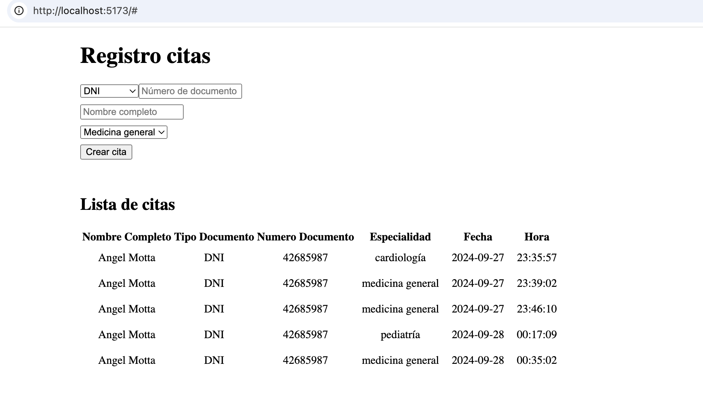
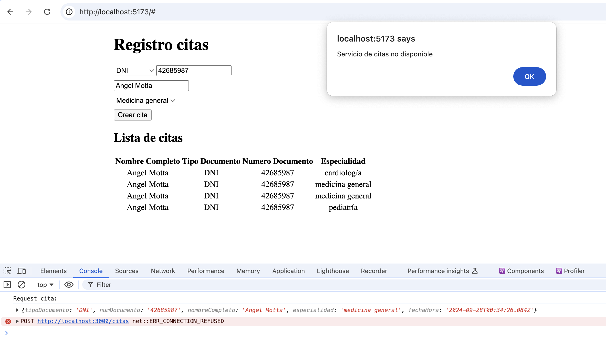
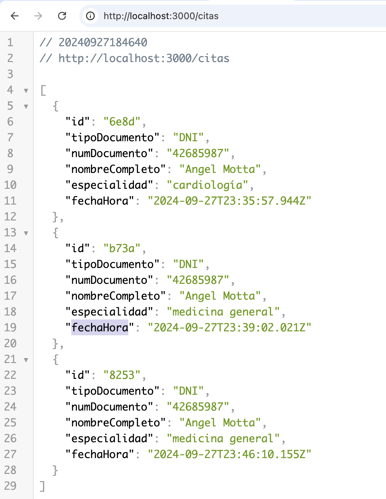

# App-citas-challenge-sl

## Aplicación Frontend

Se implementaron los siguientes casos:

-   POST: creación de cita
-   GET: recuperar las citas



Control y manejo de errores

-   Se implementó el manejo de errores en solicitudes HTTP
-   Se implementó una clase custom para la captura de errores



### Control de errores

Se definió una [clase](https://github.com/angelmotta/app-citas-challenge-sl/blob/e49a603566089556453a639cc53bb653c741acdb/webapp_citas/src/components/RequestCitaForm.tsx#L2) custom para capturar los errores que pudieran ocasionarse al momento de `crear cita`

```ts
class ApiError extends Error {
    code: number;
    constructor(message: string, code: number) {
        super(message);
        this.code = code;
    }
}
```

Para iniciar el servicio web y un servicio mock HTTP

```
cd webapp_citas
npm run dev
npm run server (desde otra terminal)
```

## Backend

En esta entrega se ha utilizado un mock REST API con la finalidad que la aplicación frontend pueda realizar solicitudes HTTP

Para levantar el servicio mock ejecutar

```
cd webapp_citas
npm run server
```


